# AWS DevOps Code Challenge 1

**A two-part web application (React + Node.js), deployed to the cloud the way real companies do it: containerized, load-balanced, auto-scaling, and released through an automated pipeline.**

[](#)
[](#)
[](#)
[](#)

> **See also:** [DevOps Code Challenge 2](https://github.com/jay-mundo/devops-code-challenge2), the follow-up project that moves this style of deployment to Kubernetes (EKS) with Helm, GitHub Actions, and Argo CD.

---

## Table of Contents

1. [The 60-Second Summary](#1-the-60-second-summary)
2. [Start Here: What Is "The Cloud"?](#2-start-here-what-is-the-cloud)
3. [Plain-English Glossary](#3-plain-english-glossary)
4. [The Application](#4-the-application)
5. [The Big Picture](#5-the-big-picture)
6. [What Happens When Someone Visits the Website](#6-what-happens-when-someone-visits-the-website)
7. [Technology Stack](#7-technology-stack)
8. [Project Structure](#8-project-structure)
9. [Run It Locally](#9-run-it-locally)
10. [Docker: Packaging the Apps](#10-docker-packaging-the-apps)
11. [Amazon ECR: Storing the Packages](#11-amazon-ecr-storing-the-packages)
12. [Terraform: Building the Infrastructure with Code](#12-terraform-building-the-infrastructure-with-code)
13. [Networking: The Private Neighborhood (VPC)](#13-networking-the-private-neighborhood-vpc)
14. [Amazon ECS and Fargate: Running the Containers](#14-amazon-ecs-and-fargate-running-the-containers)
15. [Jenkins CI/CD: The Automated Assembly Line](#15-jenkins-cicd-the-automated-assembly-line)
16. [Autoscaling: Handling Traffic Spikes Automatically](#16-autoscaling-handling-traffic-spikes-automatically)
17. [Load Testing: Proof It Holds Up](#17-load-testing-proof-it-holds-up)
18. [Security Practices](#18-security-practices)
19. [Cost Considerations and Cleanup](#19-cost-considerations-and-cleanup)
20. [Interview Explanation](#20-interview-explanation)
21. [Skills Demonstrated](#21-skills-demonstrated)

---

## 1. The 60-Second Summary

I built a small web application with a **React frontend** and a **Node.js/Express backend**, then deployed it to Amazon Web Services (AWS) using the same tools and practices used by professional engineering teams.

The application is simple on purpose. The real project is **everything around it**:

| Goal | How it was achieved |
|------|---------------------|
| Run the app on the internet | Deployed to **Amazon Web Services (AWS)** |
| Build the servers with code, not clicks | **Terraform** (Infrastructure as Code) |
| Make the app run the same everywhere | **Docker** containers |
| Run containers without managing servers | **Amazon ECS on AWS Fargate** |
| Share traffic and give the site one public address | **Application Load Balancer** |
| Handle sudden traffic spikes | **ECS Service Auto Scaling** |
| Release new versions automatically | **Jenkins** pipeline |
| Prove it holds up under pressure | **Siege** load test: 250 simultaneous users |

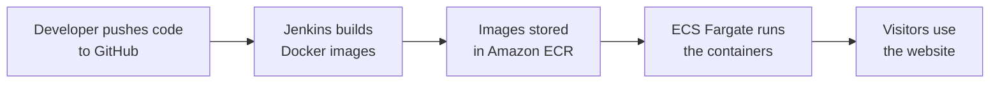

---

## 2. Start Here: What Is "The Cloud"?

> If you already know what the cloud is, skip to [Section 4](#4-the-application).

### The simple definition

**The cloud means renting computers that live in someone else's building, and using them over the internet.**

Instead of buying, powering, cooling, and maintaining your own servers, you rent exactly what you need from a company like Amazon (**AWS**), and pay only for the time you use.

### An analogy: opening a restaurant

| Cloud concept | Restaurant analogy |
|---------------|--------------------|
| **Buying your own servers** | Building your own restaurant building from scratch |
| **Using the cloud (AWS)** | Renting a fully equipped commercial kitchen by the hour |
| **The application** | The recipes and the dishes you serve |
| **A container (Docker)** | A sealed meal kit: everything needed is inside, so the dish tastes the same in any kitchen |
| **ECS (container orchestrator)** | The kitchen manager who decides which cooks make which dishes and replaces anyone who goes home sick |
| **Fargate** | A kitchen where the building, stoves, and equipment are maintained for you. You only bring the meal kits |
| **Load balancer** | The host at the front door who seats guests evenly and points them to the right counter |
| **Autoscaling** | Automatically adding more cooks when the restaurant gets busy, and sending them home when it quiets down |
| **Terraform** | Written blueprints so the entire restaurant can be rebuilt exactly the same way at any time |
| **CI/CD pipeline (Jenkins)** | An automated assembly line that packages each new recipe and puts it on the menu without anyone doing it by hand |

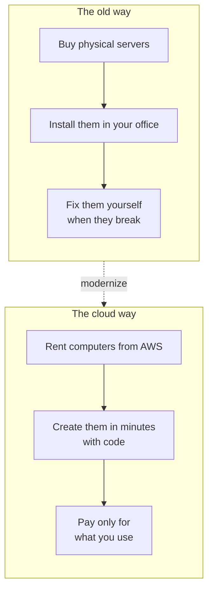

### Why does this matter?

- **Reliable:** if one copy of the app fails, another takes over automatically.
- **Flexible:** a site can handle 10 visitors or 10,000 by adding and removing copies as needed.
- **Repeatable:** the whole setup is written as code, so it can be rebuilt in minutes.
- **Automated:** new versions of the app go live without manual steps.

---

## 3. Plain-English Glossary

| Term | What it means in simple words |
|------|-------------------------------|
| **AWS** | Amazon's cloud: a huge collection of rentable computing services |
| **Region** | The geographic area where AWS resources live. This project uses `us-east-1` (N. Virginia) |
| **Availability Zone (AZ)** | A separate data center within a region. Using several protects against one failing |
| **VPC** | A private, isolated network inside AWS, like a gated neighborhood |
| **Subnet** | A section of the VPC. *Public* subnets face the internet, *private* subnets are hidden |
| **Internet Gateway** | The door that connects the VPC to the internet |
| **NAT Gateway** | A one-way door: lets private resources reach out to the internet without letting anyone reach in |
| **Security Group** | A virtual firewall that controls which traffic is allowed in and out |
| **Docker / Container** | A sealed package holding the app and everything it needs to run |
| **Image** | The blueprint a container is created from |
| **ECR** | Amazon's storage warehouse for container images |
| **ECS** | Amazon's service for running and managing containers |
| **Fargate** | A way to run ECS containers without managing any servers yourself |
| **Task definition** | The recipe card that tells ECS how to run a container (image, CPU, memory, ports) |
| **Task** | One running copy of a container |
| **Service** | An ECS instruction: "always keep N tasks of this app running" |
| **Application Load Balancer (ALB)** | The public front door that spreads traffic across tasks and routes it to the right app |
| **CloudWatch** | AWS's monitoring and logging service |
| **Auto Scaling** | Automatically adding or removing tasks based on how busy they are |
| **Terraform** | A tool that builds cloud infrastructure from written code |
| **IaC** | *Infrastructure as Code*: managing servers and networks with files instead of manual clicks |
| **CI/CD** | *Continuous Integration / Continuous Delivery*: automatic build and release |
| **Jenkins** | A CI/CD automation server |
| **IAM** | AWS's permission system: who is allowed to do what |

---

## 4. The Application

The app has two parts that talk to each other:

| Part | Technology | Port | Job |
|------|------------|------|-----|
| **Frontend** | React | `3000` | The web page people see and click on |
| **Backend** | Node.js / Express | `8080` | The API that serves data to the frontend |

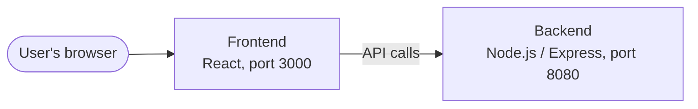

Each part runs in its own Docker container, so they can be built, deployed, and scaled independently.

---

## 5. The Big Picture

This is the whole system on one page. Each box is explained in detail later.

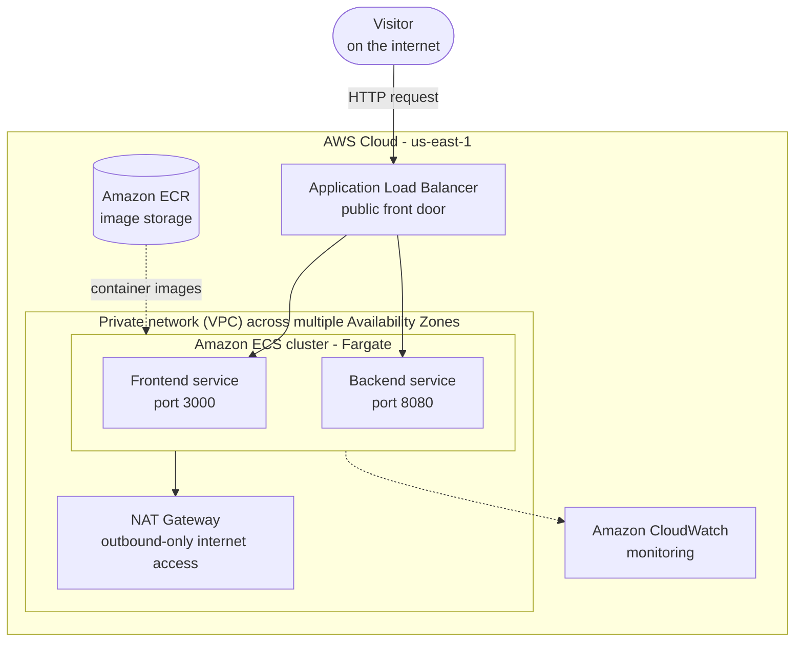

**How to read it:** a visitor reaches the load balancer, which sends the request to either the frontend or the backend service. The containers those services run are pulled from ECR, and the NAT gateway lets private resources reach out to the internet when they need to.

### How the project is built and delivered

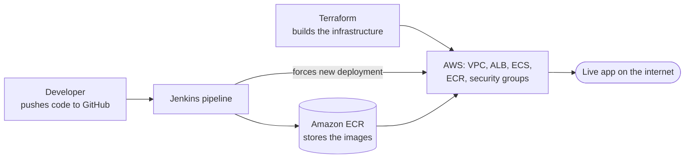

---

## 6. What Happens When Someone Visits the Website

Step by step, from typing the address to seeing the page:

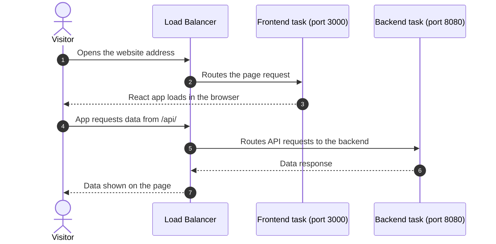

The load balancer is the single public address. It decides, based on the request, whether the frontend or the backend should answer.

---

## 7. Technology Stack

| Category | Technologies |
|----------|--------------|
| **Application** | React, Node.js, Express, JavaScript |
| **Containers** | Docker, Amazon ECR |
| **Compute** | Amazon ECS, AWS Fargate |
| **Networking** | Amazon VPC, public and private subnets, Internet Gateway, NAT Gateway, Application Load Balancer |
| **Monitoring and scaling** | Amazon CloudWatch, ECS Service Auto Scaling |
| **Infrastructure as Code** | Terraform |
| **CI/CD** | Jenkins, GitHub |
| **Testing** | Siege (load testing) |

---

## 8. Project Structure

```text
devops-code-challenge1/
├── backend/
│   ├── Dockerfile
│   ├── index.js
│   ├── config.js
│   ├── package.json
│   └── package-lock.json
├── frontend/
│   ├── Dockerfile
│   ├── src/
│   ├── package.json
│   └── package-lock.json
├── terraform/          # All AWS infrastructure as code
├── Jenkinsfile         # The CI/CD pipeline definition
└── README.md
```

---

## 9. Run It Locally

### Prerequisites

- Git
- Node.js and npm
- Docker
- AWS CLI
- Terraform
- Jenkins (for the pipeline)
- An AWS account with appropriate IAM permissions

Verify the tools are installed:

```bash
git --version
node --version
npm --version
docker --version
aws --version
terraform version
```

### Backend

```bash
cd backend
npm ci
npm start
```

Runs at http://localhost:8080

### Frontend

Open a second terminal:

```bash
cd frontend
npm ci
npm start
```

Runs at http://localhost:3000

> `npm ci` installs the exact versions recorded in `package-lock.json`, which makes builds repeatable. That's why it's preferred over `npm install` in pipelines.

---

## 10. Docker: Packaging the Apps

**What it is:** Docker puts each app and everything it needs into a sealed package called a **container**. It runs identically on a laptop or in the cloud, which solves the classic "it works on my machine" problem.

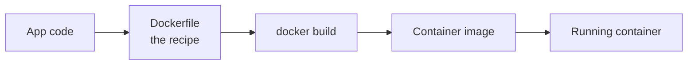

### Build the images

```bash
docker build -t backend ./backend
docker build -t frontend ./frontend
```

### Run the containers

```bash
docker run -d --name backend -p 8080:8080 backend
docker run -d --name frontend -p 3000:3000 frontend
```

- **`-d`** runs the container in the background.
- **`-p 8080:8080`** connects a port on your computer to the same port inside the container.

### Build for the cloud's processor type

The ECS Fargate workloads run on **x86_64 (Linux AMD64)** infrastructure, so the images deployed to ECS must be built for **Linux AMD64**. This matters when building on an Apple Silicon Mac, which produces ARM images by default.

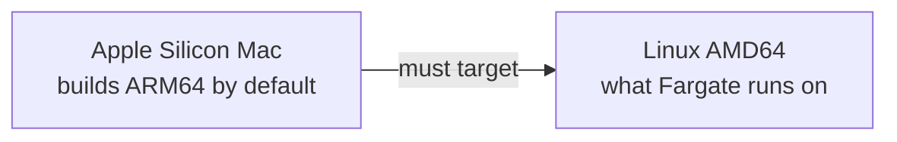

---

## 11. Amazon ECR: Storing the Packages

**What it is:** ECR (Elastic Container Registry) is a private warehouse for container images. Jenkins puts images in; ECS takes them out.

| Repository | Holds |
|------------|-------|
| `devops-frontend` | The React frontend image |
| `devops-backend` | The Node.js backend image |

Authenticate Docker with ECR:

```bash
aws ecr get-login-password --region us-east-1 | \
docker login \
  --username AWS \
  --password-stdin \
  <AWS_ACCOUNT_ID>.dkr.ecr.us-east-1.amazonaws.com
```

The images are tagged and pushed to ECR before being deployed to ECS.

---

## 12. Terraform: Building the Infrastructure with Code

**What it is:** Instead of clicking through the AWS website to create networks, load balancers, and clusters, Terraform reads **written files** and builds everything automatically. If something is deleted, it can be recreated identically.

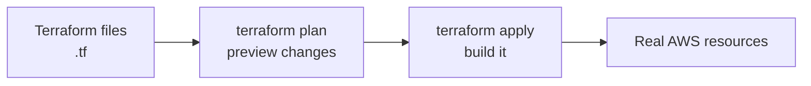

### What Terraform provisions

| Area | Resources |
|------|-----------|
| **Networking** | VPC, public and private subnets across multiple Availability Zones, Internet Gateway, NAT Gateway, route tables, security groups |
| **Traffic** | Application Load Balancer |
| **Compute** | ECS cluster, ECS services, ECS task definitions |
| **Images** | ECR repositories |
| **Scaling** | ECS Service Auto Scaling |

### Commands

```bash
cd terraform
terraform init      # Download providers and prepare the folder
terraform plan      # Preview what will change
terraform apply     # Build the infrastructure
```

> Always review `terraform plan` before applying changes. It shows exactly what will be created, changed, or destroyed.

---

## 13. Networking: The Private Neighborhood (VPC)

**What it is:** A **VPC** is a private network inside AWS, like a gated community. Inside it, **subnets** are streets: some are open to visitors (public), some are hidden from the outside (private).

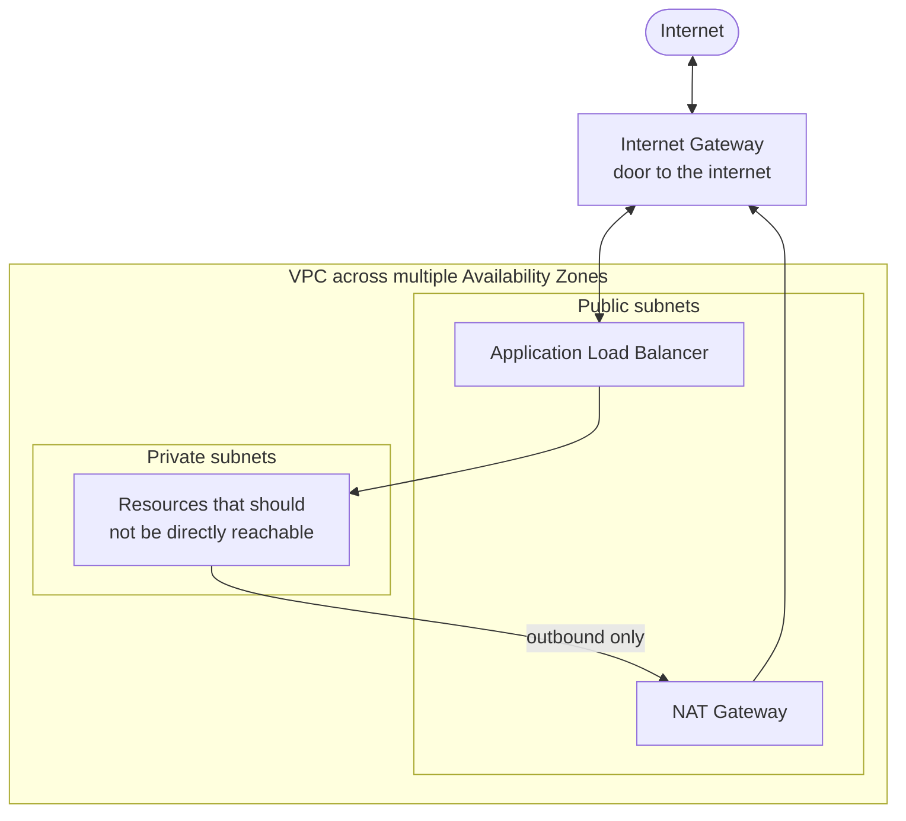

- **Public subnets** hold internet-facing infrastructure, such as the load balancer and the NAT gateway.
- **Private subnets** hold resources that shouldn't be reachable directly from the internet.
- **The NAT Gateway** lets private resources reach out (for example, to download updates or pull images) **without letting anyone reach in**.
- **Multiple Availability Zones** mean that if one data center has a problem, the application can keep running in another.

---

## 14. Amazon ECS and Fargate: Running the Containers

**What it is:** ECS is the service that runs and manages the containers. **Fargate** is the way it runs them with no servers for you to manage: you describe the container and how much CPU and memory it needs, and AWS finds the capacity.

| Setting | Value |
|---------|-------|
| ECS cluster | `devops-challenge-cluster` |
| Frontend service | `devops-challenge-frontend` |
| Backend service | `devops-challenge-backend` |
| CPU per task | 0.5 vCPU |
| Memory per task | 1 GB |
| Frontend port | 3000 |
| Backend port | 8080 |

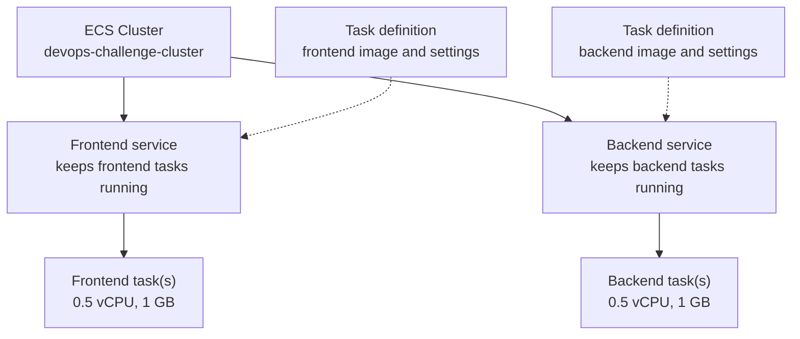

### How the pieces relate

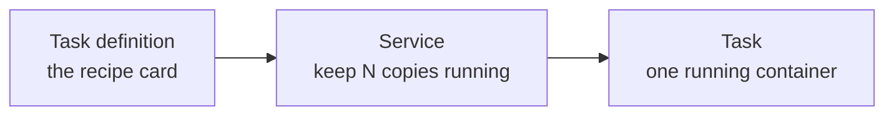

If a task crashes, the service notices and starts a replacement automatically. The **Application Load Balancer** is the public entry point and routes traffic to the right service.

---

## 15. Jenkins CI/CD: The Automated Assembly Line

**What it is:** Jenkins automates the release process. When code changes, Jenkins builds new container images, stores them in ECR, and tells ECS to roll out the new versions. No one has to run these steps by hand.

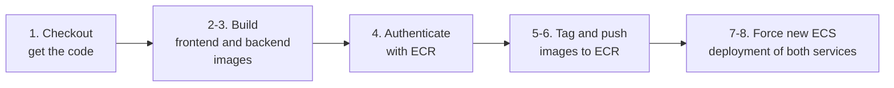

### Pipeline stages

| # | Stage | What happens |
|---|-------|--------------|
| 1 | **Checkout** | Jenkins pulls the GitHub repository |
| 2 | **Build frontend** | Builds the frontend Docker image |
| 3 | **Build backend** | Builds the backend Docker image |
| 4 | **Authenticate** | Logs in to Amazon ECR |
| 5 | **Tag** | Tags the Docker images |
| 6 | **Push** | Pushes the images to ECR |
| 7 | **Deploy frontend** | Forces a new ECS deployment for the frontend service |
| 8 | **Deploy backend** | Forces a new ECS deployment for the backend service |

The pipeline is defined in the `Jenkinsfile` at the root of the repository, in a Jenkins job named `TC1`.

### What "force new deployment" means

ECS services point at an image in ECR. Pushing a new image doesn't automatically restart anything, so Jenkins tells ECS to start fresh tasks that pull the latest image, then retire the old ones.

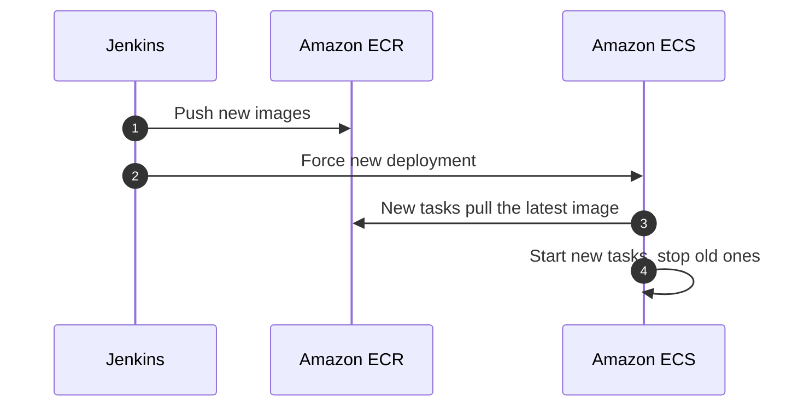

### Credentials

AWS credentials used by Jenkins are stored in **Jenkins Credentials Manager** and are **not hard-coded** into the `Jenkinsfile`.

> **Looking ahead:** [Challenge 2](https://github.com/jay-mundo/devops-code-challenge2) takes this a step further by using an IAM role for Jenkins and OIDC for GitHub Actions, so no long-lived access keys need to be stored at all.

---

## 16. Autoscaling: Handling Traffic Spikes Automatically

**What it is:** The **frontend** ECS service uses **target tracking** on average CPU utilization. When the tasks get too busy, ECS adds more copies. When things calm down, it removes them. This is like adding more cooks during the dinner rush.

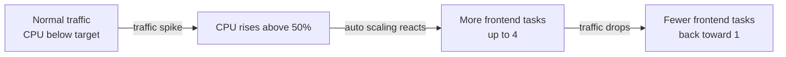

| Setting | Value |
|---------|-------|
| Minimum tasks | 1 |
| Maximum tasks | 4 |
| CPU target | 50% |
| Scale-out cooldown | 60 seconds |
| Scale-in cooldown | 60 seconds |
| Scaling metric | `ECSServiceAverageCPUUtilization` |

The **cooldowns** stop the system from adding and removing tasks too rapidly: after any scaling action, ECS waits 60 seconds before acting again.

---

## 17. Load Testing: Proof It Holds Up

**Siege 4.2.0** was used to simulate heavy traffic against the public endpoint.

| Test setting | Value |
|--------------|-------|
| Concurrent users | 250 |
| Duration | 2 minutes |

### Results

| Metric | Result |
|--------|--------|
| Transactions | 20,496 |
| Availability | **99.97%** |
| Failed transactions | 6 |
| Response time | 1.46 seconds |
| Transaction rate | 169.94 transactions/sec |
| Concurrency | 248.18 |
| Throughput | 2.32 MB/sec |

**In plain English:** about 250 people hitting the site at the same moment for two minutes produced over 20,000 requests, and only 6 failed. The system stayed available 99.97% of the time.

---

## 18. Security Practices

| Practice | Why it matters |
|----------|----------------|
| AWS credentials kept in **Jenkins Credentials Manager** | Never hard-coded into the `Jenkinsfile` or the repository |
| Public vs. private **subnets** | Only the load balancer needs to face the internet |
| **Security groups** | Control which traffic is allowed to reach each component |
| **NAT Gateway** | Private resources can reach out without being reachable from outside |
| Single public entry point (**ALB**) | Smaller attack surface |
| Infrastructure defined in **Terraform** | Changes are reviewed with `terraform plan` before they happen |

> **Never commit** AWS access keys, secret keys, GitHub tokens, Jenkins passwords, or other credentials to the repository.

---

## 19. Cost Considerations and Cleanup

This project uses AWS services that **charge while running**:

- AWS Fargate tasks (billed for the CPU and memory they use)
- NAT Gateway
- Application Load Balancer
- Jenkins server (EC2)
- ECR image storage
- CloudWatch log storage

### Cleaning up

Terraform can remove everything it created:

```bash
cd terraform
terraform destroy
```

> **Review the destruction plan carefully before confirming.** `terraform destroy` permanently deletes the infrastructure it manages.

Things Terraform may **not** remove:

- **Jenkins infrastructure** created outside Terraform must be removed separately.
- **ECR repositories** that still contain images may need to be emptied first.
- **CloudWatch log groups** can remain after the services are gone.

After cleaning up, double-check the AWS console (or CLI) for leftover load balancers, NAT gateways, Elastic IPs, and EC2 instances, since those are the ones that keep billing.

---

## 20. Interview Explanation

> "I built a React frontend and a Node.js/Express backend, containerized both with Docker, and deployed them to AWS using Terraform. Terraform created the VPC with public and private subnets across multiple Availability Zones, an Internet Gateway, a NAT Gateway, security groups, an Application Load Balancer, the ECS cluster on Fargate, and the ECR repositories. I set up a Jenkins pipeline that builds both images, pushes them to ECR, and forces a new ECS deployment for each service. I configured target-tracking auto scaling on the frontend based on 50% CPU, and load-tested the public endpoint with Siege at 250 concurrent users, which gave 99.97% availability."

---

## 21. Skills Demonstrated

| Area | Skills |
|------|--------|
| **Cloud** | AWS, VPC, ECS, Fargate, ECR, ALB, NAT Gateway, Security Groups, CloudWatch |
| **Infrastructure as Code** | Terraform |
| **Containers** | Docker, multi-service container builds, image registries |
| **CI/CD** | Jenkins, GitHub, pipeline automation |
| **Scaling and testing** | ECS Service Auto Scaling, load testing with Siege |
| **Frontend / backend** | React, Node.js, Express |
| **Fundamentals** | Linux, Bash, Git, troubleshooting |

---

## Repository

GitHub: <https://github.com/jay-mundo/devops-code-challenge1>
